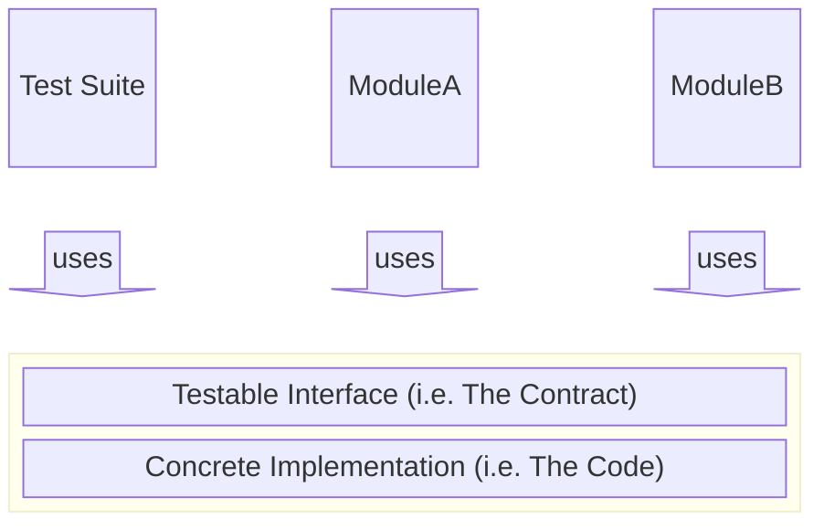

<h1 align="center">Testable-Interface Driven Development (TIDD)</h1>



## TL;DR
* **``Interfaces are testable contracts.``**
* **``Tests are proof of good interface design.``**
* **``Implementations are interchangeable so long as they adhere to the contract.``**

When you design interfaces that are inherently testable, your system becomes modular, maintainable, and future-proof.

> [!TIP]
> **TIDD** is focused on **module-level design**, ensuring that every interface is testable and that every test targets an interface, not an implementation. 
>
> If you're interested in a **larger architectural strategy for complex systems**, check out the companion project: [**Recursive Boxes**](https://github.com/kartikg33/recursive-boxes).

## What is TIDD?

**TIDD** is a design and development philosophy that unifies the best of **Test-Driven Development (TDD)** and **Interface-Driven Design (IDD)** while addressing their shortcomings.

- **TDD** often leads to brittle tests tied too closely to implementation details, resulting in having to refactor test code every time the implementation changes.  
- **IDD** often creates abstract interfaces that aren’t practically testable for real-world scenarios.

**TIDD fixes both** by demanding that **every interface is testable** and that **every test is bound to a versioned interface, not an implementation**.

- **TIDD fixes IDD’s weakness** by ensuring that interfaces are always testable against real use cases.  
- **TIDD fixes TDD’s weakness** by ensuring tests are written against versioned contracts, not against however the latest code has been implemented.

This results in **modular, resilient codebases** with a **vastly reduced maintenance cost**.

## Core Principles

1. **Every Interface Must Come With Tests; Poor Tests Reveal Poor Design.**
    - If you can’t write real-world test cases for an interface, or if the tests are weak and meaningless, the interface likely needs redesigning.
    - Testability isn’t optional: it is the proof of a good interface.
    - Test cases should live alongside Interface definitions. Both should be developed, versioned, and released together, ideally from the same location. 

2. **Tests Must Target Versioned Interfaces, Not Code Implementations.**  
    - Tests must validate the **contract** — the promised behaviour of an interface — not the inner workings of the code.
    - If you can’t define a stable, versioned interface for your tests, you should go back to the drawing board.
    - Code is volatile but Interfaces are static. That means code implementations can be changed freely without impacting the test cases so long as the interface remains intact.

## Practical Workflow Example

> [!TIP]
> See the [`examples/`](./examples/) folder for more information.

1. **Define the interface contract**  
   Example:
   ```ts
   interface PaymentProcessor {
     charge(userId: string, amount: number): PaymentResult
   }
    ```

2. **Write interface-oriented tests**

   * Rejects invalid inputs
   * Returns structured results
   * Meets documented constraints (e.g. `amount > 0`, `transactionId` is UUID)

3. **Run tests against the interface contract**

   * Works with mocks, stubs, or real implementations
   * Implementations can change without breaking tests, as long as they respect the contract
   * The **tests remain the same** no matter which implementation is used.

## Contributing
Here's how you can contribute:
* Add language-specific examples in the [``examples/``](./examples/) directory.
* Build tooling for interface + test co-definition
* Spread TIDD as a practical, test-first *design* methodology