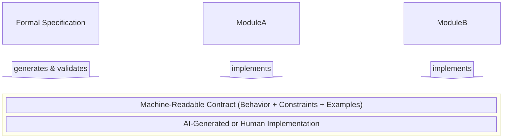

<h1 align="center">Spec Driven Development (SDD)</h1>

> **Evolution from TIDD (Testable-Interface Driven Development)**  
> SDD takes TIDD's principles and makes them AI-native by using machine-readable specifications as the source of truth.


```mermaid
block-beta
    columns 5
    spec["Formal Specification"] space ModuleA space ModuleB
    arrow1<["generates & validates"]>(down) space arrow2<["implements"]>(down) space arrow3<["implements"]>(down) 
    block:module:5
        columns 1
        contract["Machine-Readable Contract (Behavior + Constraints + Examples)"]
        impl["AI-Generated or Human Implementation"]
    end
```

## TL;DR
* **``Specifications are executable contracts.``**
* **``Specifications are machine-readable and AI-native.``**
* **``Implementations can be generated, validated, and evolved from specs.``**

When you define formal specifications that machines can understand, your system becomes not just modular and maintainable, but also AI-augmented and auto-validatable.

> [!NOTE]
> **TIDD → SDD Evolution**  
> TIDD focused on interfaces + tests written by humans. SDD elevates this by making specifications:
> - **Machine-readable** (parseable by tools and AI)
> - **Executable** (can generate tests, mocks, and implementations)
> - **AI-native** (optimized for LLM consumption and generation)

> [!TIP]
> **SDD** is focused on **specification-first design**, ensuring that every module's behavior is formally specified before implementation. 
>
> If you're interested in a **larger architectural strategy for complex systems**, check out the companion project: [**Recursive Boxes**](https://github.com/kartikg33/recursive-boxes).

## What is SDD?

**SDD (Spec Driven Development)** is an AI-native evolution of TIDD that uses **formal, machine-readable specifications** as the primary development artifact.

### Evolution from TIDD

**TIDD** (Testable-Interface Driven Development) unified TDD and IDD by demanding testable interfaces. SDD takes this further:

- **TIDD** used interfaces + test code (human-readable)
- **SDD** uses formal specifications (machine-readable and executable)

### Why SDD is AI-Native

1. **Specifications as Prompts**: Formal specs serve as structured prompts for LLMs to generate implementations
2. **Automatic Validation**: Specs include constraints that can be validated automatically
3. **Behavior Examples**: Specs include concrete examples that both humans and AI can understand
4. **Schema-Driven**: Uses standard formats (JSON Schema, OpenAPI, TypeSpec) that tools and AI understand
5. **Version-Controlled Contracts**: Specs are versioned separately from code, enabling evolution

### What Problems Does SDD Solve?

- **Manual test writing**: Specs generate test cases automatically
- **Implementation guesswork**: AI can generate correct implementations from clear specs
- **Documentation drift**: Specs are the documentation and stay in sync
- **Integration complexity**: Machine-readable specs enable automatic client/server generation
- **Validation gaps**: Formal constraints enable automatic validation

## MCP: The Perfect SDD Format

**Model Context Protocol (MCP)** is the exemplar specification format for SDD:

- **JSON Schema-based**: Every tool has a formal inputSchema
- **Machine-readable**: LLMs can parse and understand MCP directly
- **Validation built-in**: Automatic input/output validation
- **AI-native design**: Created specifically for AI/LLM consumption
- **Testable contracts**: MCP schemas define executable contracts

### Why Use MCP for SDD?

```json
{
  "name": "my_tool",
  "description": "Human and AI readable description",
  "inputSchema": {
    "type": "object",
    "properties": {
      "param": {
        "type": "string",
        "pattern": "^[A-Z]+$",
        "description": "Constraints are enforceable"
      }
    },
    "required": ["param"]
  }
}
```

This single MCP definition provides:
- ✓ Type safety (JSON Schema)
- ✓ Validation rules (pattern, required)
- ✓ Documentation (description)
- ✓ AI understanding (structured format)
- ✓ Test generation (from schema constraints)

See [`examples/mcp-example.md`](./examples/mcp-example.md) for a complete implementation example.

## Core Principles

1. **Every Module Must Have a Formal Specification; Poor Specs Reveal Poor Design.**
    - Specifications must be machine-readable and include behavior, constraints, and examples
    - If you can't formally specify a module's behavior, the design likely needs rethinking
    - Specifications should be versioned, released, and maintained alongside (or before) code

2. **Specifications Must Be Executable and Validatable.**  
    - Specs must generate tests, mocks, and validation logic automatically
    - Specs should serve as both documentation and contract enforcement
    - Implementation can be human-written or AI-generated, but must satisfy the spec

3. **Specifications Are AI-Native First-Class Citizens.**
    - Specs should be optimized for LLM consumption (clear structure, examples, constraints)
    - Specs serve as prompts for AI to generate correct implementations
    - Specs enable AI to validate, test, and evolve code automatically

## Specification Format

SDD specifications should be:

1. **Machine-Readable**: Use standard formats like JSON Schema, OpenAPI, TypeSpec, or similar
2. **Behavior-Driven**: Include expected behaviors with concrete examples
3. **Constraint-Rich**: Define validation rules, boundaries, and invariants
4. **Versioned**: Track changes and maintain backward compatibility
5. **Self-Documenting**: Human-readable while being machine-processable

### Example Spec Structure

```yaml
specification:
  version: "1.0.0"
  module: "PaymentProcessor"
  
  interface:
    charge:
      inputs:
        - name: userId
          type: string
          format: uuid
          description: "Unique identifier for the user"
        - name: amount
          type: number
          constraints:
            minimum: 0.01
            maximum: 1000000
          description: "Amount to charge in USD"
      
      outputs:
        type: object
        properties:
          transactionId:
            type: string
            format: uuid
          status:
            type: string
            enum: [success, failed, pending]
          timestamp:
            type: string
            format: date-time
      
      behaviors:
        - description: "Rejects negative amounts"
          example:
            input: { userId: "123e4567-e89b-12d3-a456-426614174000", amount: -10 }
            output: { error: "Amount must be positive" }
        
        - description: "Succeeds with valid inputs"
          example:
            input: { userId: "123e4567-e89b-12d3-a456-426614174000", amount: 99.99 }
            output: 
              status: success
              transactionId: "987e6543-e21b-98d7-b654-321654987000"
```

## Practical Workflow

> [!TIP]
> See the [`examples/`](./examples/) folder for concrete implementations, especially [`mcp-example.md`](./examples/mcp-example.md) for MCP-based SDD.

### SDD with MCP (Model Context Protocol)

**MCP is the ideal format for SDD** because it's designed for AI consumption and provides built-in JSON Schema validation.

#### 1. Define the MCP Tool Schema

```json
{
  "name": "calculate_total",
  "description": "Calculate total price with tax and discount",
  "inputSchema": {
    "type": "object",
    "properties": {
      "price": {
        "type": "number",
        "minimum": 0,
        "description": "Base price"
      },
      "taxRate": {
        "type": "number",
        "minimum": 0,
        "maximum": 1,
        "description": "Tax rate as decimal (e.g., 0.08 for 8%)"
      },
      "discount": {
        "type": "number",
        "minimum": 0,
        "maximum": 1,
        "default": 0,
        "description": "Discount rate as decimal"
      }
    },
    "required": ["price", "taxRate"]
  }
}
```

#### 2. Write Test Cases Against the Schema

```javascript
const tests = {
  async test_basic_calculation({ calculate_total }) {
    const result = await calculate_total({
      price: 100,
      taxRate: 0.08
    });
    assert.equal(result, 108); // 100 + 8% tax
  },
  
  async test_with_discount({ calculate_total }) {
    const result = await calculate_total({
      price: 100,
      taxRate: 0.08,
      discount: 0.10
    });
    assert.equal(result, 97.2); // (100 - 10%) + 8% tax
  },
  
  async test_rejects_negative_price({ calculate_total }) {
    await assert.rejects(
      () => calculate_total({ price: -10, taxRate: 0.08 }),
      /minimum/
    );
  }
};
```

#### 3. Implement (Validated Automatically)

```javascript
const Ajv = require('ajv');
const ajv = new Ajv();
const validate = ajv.compile(schema.inputSchema);

function calculate_total(params) {
  // Automatic validation from schema
  if (!validate(params)) {
    throw new Error(ajv.errorsText(validate.errors));
  }
  
  const { price, taxRate, discount = 0 } = params;
  const afterDiscount = price * (1 - discount);
  return afterDiscount * (1 + taxRate);
}
```

#### 4. AI Can Generate Implementation

Prompt an LLM with:
```
Implement this MCP tool according to the schema and test cases:
[schema + tests]
```

The LLM generates validated code because the contract is machine-readable.

### General SDD Workflow (Any Spec Format)

### 1. Write the Specification First (Using MCP or Other Formats)

Define the module's behavior formally:
- What are the inputs and outputs?
- What constraints must be satisfied?
- What are the expected behaviors with examples?
- What edge cases need handling?

### 2. Generate Validation & Tests from Spec

Use tooling to automatically generate:
- Input validation logic
- Test cases from behavior examples
- Mock implementations for testing
- Client/server code (if applicable)

### 3. Implement (Human or AI)

Implementation approaches:
- **AI-Generated**: Feed the spec to an LLM as a prompt
- **Human-Written**: Use the spec as a detailed requirement doc
- **Hybrid**: AI generates base, human refines

### 4. Validate Against Spec

Automatically verify that implementation:
- Satisfies all constraints
- Passes all behavior examples
- Handles all specified edge cases
- Maintains contract compatibility

### 5. Evolve the Spec

When requirements change:
- Update the spec first (with version bump)
- Regenerate tests/validation
- Update or regenerate implementation
- Verify backward compatibility

## SDD vs TIDD vs TDD

| Aspect | TDD | TIDD | SDD |
|--------|-----|------|-----|
| **Primary Artifact** | Test Code | Interface + Tests | Formal Specification |
| **Machine Readable** | No | Partially | Yes |
| **AI-Native** | No | No | Yes |
| **Auto-Generation** | No | No | Tests, Mocks, Code |
| **Validation** | Manual | Manual | Automatic |
| **Documentation** | Separate | Separate | Spec IS docs |

## Benefits of SDD

### For Developers
- **Less boilerplate**: Generate tests and validation automatically
- **Clearer contracts**: Formal specs are more precise than comments
- **Faster iteration**: Change spec, regenerate code and tests
- **Better collaboration**: Specs are single source of truth

### For AI/LLMs
- **Better prompts**: Structured specs are ideal LLM inputs
- **Validation**: LLMs can verify their output against specs
- **Consistency**: Same spec generates consistent implementations
- **Learning**: LLMs learn from spec patterns

### For Teams
- **Contract-first**: Frontend/backend can work in parallel
- **Version management**: Spec versions track API evolution
- **Automatic integration**: Generate clients from specs
- **Quality gates**: Automated spec validation

## Tools & Ecosystem

SDD works with existing specification tools:

- **MCP (Model Context Protocol)**: JSON Schema-based tool definitions - **IDEAL FOR SDD**
- **OpenAPI/Swagger**: For REST APIs
- **AsyncAPI**: For event-driven architectures
- **JSON Schema**: For data structures
- **TypeSpec**: For type-safe specifications
- **GraphQL Schema**: For GraphQL APIs
- **Protocol Buffers**: For gRPC services

### Why MCP is Perfect for SDD

**MCP (Model Context Protocol)** is an exemplar specification format for SDD because:

1. **Formal Tool Contracts**: Each tool is defined with JSON Schema for inputs/outputs
2. **Machine-Readable**: LLMs can directly parse and understand MCP schemas
3. **Validation Built-In**: JSON Schema provides automatic input/output validation
4. **AI-Native Design**: MCP was designed specifically for AI/LLM consumption
5. **Testable Interface**: MCP schemas define the contract that implementations must satisfy

Additional SDD-specific tooling can:
- Generate test suites from specs
- Validate implementations against specs
- Generate AI prompts from specs
- Track spec evolution and compatibility

## Getting Started

1. **Start small**: Pick one module to specify
2. **Choose a format**: Use a standard like OpenAPI or JSON Schema
3. **Write behaviors**: Include concrete examples
4. **Generate tests**: Use existing tools or write a simple generator
5. **Implement**: Human or AI, validated against spec
6. **Iterate**: Refine spec based on implementation learnings

## Contributing

Here's how you can contribute:
* Add language-specific examples in the [`examples/`](./examples/) directory
* Build SDD tooling for spec → test/code generation
* Create spec templates for common patterns
* Share your SDD workflow and learnings
* Develop AI integration patterns for SDD

## Migration from TIDD

If you're using TIDD:

1. **Extract specs from interfaces**: Convert interface definitions to formal specs
2. **Add behavior examples**: Document expected behaviors from existing tests
3. **Add constraints**: Formalize validation rules
4. **Generate tests**: Create test generators from specs
5. **Validate**: Ensure existing code satisfies new specs

---

<p align="center">
  <i>From testable interfaces to executable specifications</i><br>
  <i>From human-first to AI-native</i><br>
  <i>From TIDD to SDD</i>
</p>
